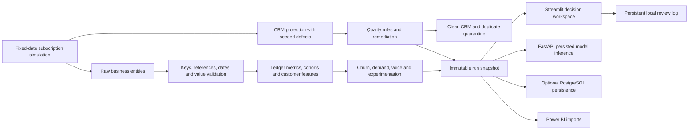
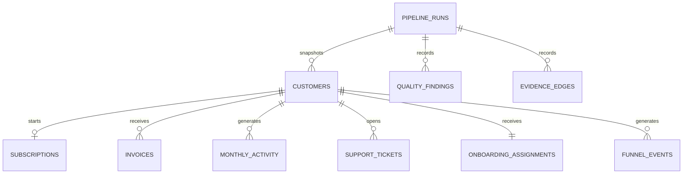

# Architecture

## Data and execution

The canonical subscription simulation is the master source. A CRM projection of those same customers deliberately contains duplicate keys, invalid emails and missing phone values. Source defects are measured and remediated explicitly. Trusted master values must not be treated as a generally available repair oracle in a real ingestion system.

The business modules use invoice-derived collected value; there is no independently invented lifetime-value column. Customer, subscription, billing, support, experiment and AI-review records share IDs. Contract reconciliation compares projections of the same subscription price and status.

## Physical layout
- `data/raw/platform/`: seven canonical source datasets.
- `data/raw/*.csv`: CRM/order/contract/AI-review projections for trust operations.
- `data/processed/customers.csv`: deduplicated CRM with invalid email set to null.
- `data/processed/customer_quarantine.csv`: duplicate CRM rows with reasons.
- `outputs/snapshots/<uuid>/`: complete computed tables, models, evaluation and reports.
- `outputs/current_run.json`: atomic pointer to the published snapshot.
- `outputs/review_history.sqlite`: append-only local human review history.

A run writes to a private building directory. Only a successfully completed run is renamed and published. Readers resolve one snapshot at the start of a request. Failed building directories remain for diagnosis and never become the current run. Raw input files can be regenerated during a failed run; published output snapshots remain independent of them.

## Relational model

Customer relationships use the composite key `(run_id, customer_id)`. Source customer IDs are stable within a seeded scenario; each generated snapshot has a new run ID. Never join different runs as if they were independent customers or a historical production time series.

PostgreSQL includes normalized dimensions/facts, constraints, indexes, a collection view and a customer value view. Generic result JSON retains analytical outputs whose schemas differ. One transaction makes a database load all-or-nothing. Existing run IDs are skipped. This code still requires integration verification against the user's PostgreSQL instance.

## Implementation choices
Streamlit and Plotly preserve the original project and provide dense internal workflows without a separate frontend build. FastAPI exposes the persisted model contract. Scikit-learn supplies baselines, clustering and classifiers; SHAP supplies local attribution. The filesystem tracks model settings, source hashes, versions and metrics per run. SQLite stores local human notes outside regenerable artifacts. Shared multi-user deployment needs authentication, authorization, a server-side review store and operational backup policies.
